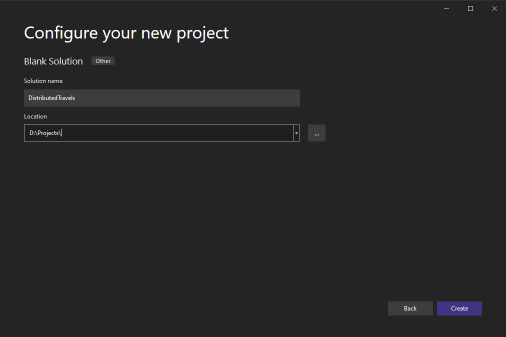
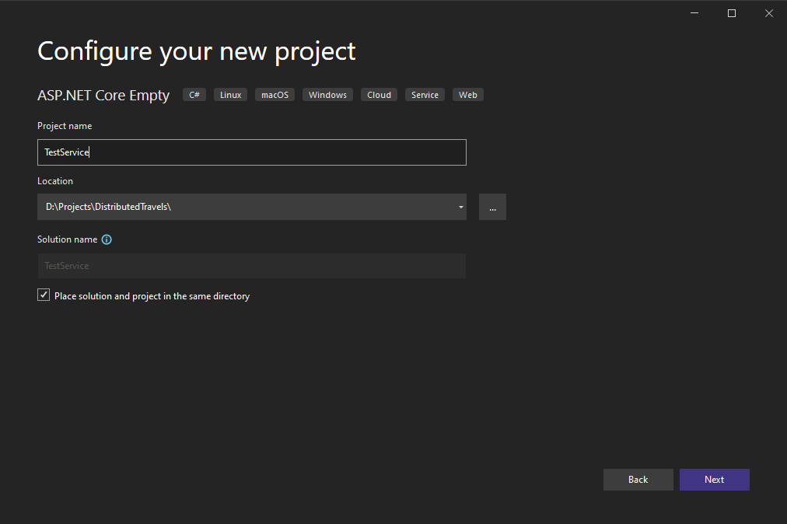
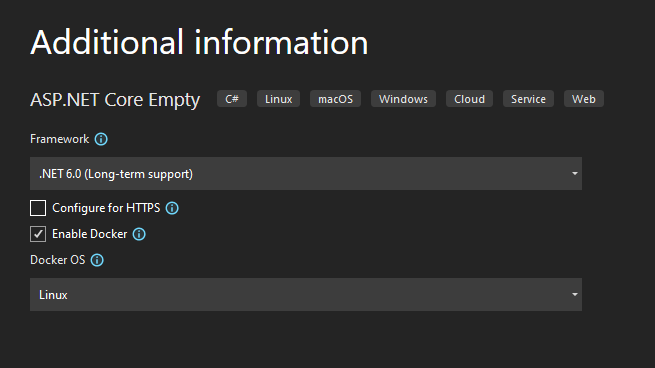
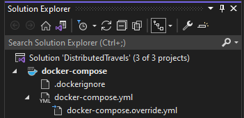
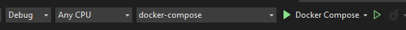

# Docker

Download [Docker Desktop](https://docs.docker.com/desktop/windows/install/) (Windows) or [Docker Engine](https://docs.docker.com/engine/install/) and [Docker Compose](https://docs.docker.com/compose/install/) (Linux).

Running docker containers can be done with
```
docker-compose -f /path/to/docker-compose.yml up -d [--build]
```
## Visual Studio Dev Setup
General project structure:
```
DistributedTravels
|- Service1
   |- Service1 Solution Files
|- Service2
|- Service3
|- Models
   |- Shared models
|- Docker
   |- sample docker-compose files
```

The docker directory/repo isn't required

Create VS Blank Solution on DistributedTravels level (the .sln file should be inside that folder). In picture the whole RSWW project will be in D:\Projects\



Clone all repos inside that folder (Service1, Service2, etc.) and add them to the new solution.


Or create new ones with those options set and then add them to the blank solutions; Preferred 




For each added ASP service, add docker orchestrator support


First one will create new brach in solution explorer called `docker-compose`, other will add few lines to file `docker-compose.yml` which can be found in that branch.



Without deleting the created contents, copy the contents of [visual studio docker-compose.yml file version](./docker-compose.visualstudio.yml) at the top of the file.

In case one of the services isn't already in the [repo file](./docker-compose.visualstudio.yml), copy the created indent in form of:
```yaml
test:
    image: ${DOCKER_REGISTRY-}test
    build:
      context: .
      dockerfile: Test/Dockerfile
```
and add it in the `services:` section like the others and then add those lines inside the service's section:
```yaml
hostname: 'test'
container_name: 'test'
depends_on:
    - rabbitmq # if it uses RabbitMQ
    - mariadb # if it uses DB
ports:
    - 8010:80 # change left port number
networks:
    - backend
```
Change left port mapping to one unused, since this one is the one used on the side of localhost, not inside the container.

Final version would look similarly to:
```yaml
transport:
    image: ${DOCKER_REGISTRY-}transport
    build:
      context: .
      dockerfile: Transport/Dockerfile
    hostname: 'transport'
    container_name: 'transport'
    depends_on:
      - rabbitmq
      - mariadb
    ports:
      - 8010:80
    networks:
      - backend
```

At this point with Docker Engine (Docker Desktop) running, it should be possible to start debugging with docker-compose via VS.



## Extra info
As the Visual Studio docker-compose doesn't exactly work the same way as command line docker-compose, to change application name (`name:` at the top of the sample file) we need to put in special parameter `<DockerComposeProjectName>` in `docker-compose.dcproj` file in main (blank) solution:
```xml
<Project ToolsVersion="15.0" Sdk="Microsoft.Docker.Sdk">
  <PropertyGroup Label="Globals">
    <DockerComposeProjectName>distributed-travels</DockerComposeProjectName>
  </PropertyGroup>
</Project>
```

-------------------------------
possibly wrong steps to disable browser launching

VS starts browser to specified address when launching debugging for container/ASP.NET projects. This can be disabled in debug options: Project > Properties > Debug > uncheck Launch browser for Docker version of debugging.